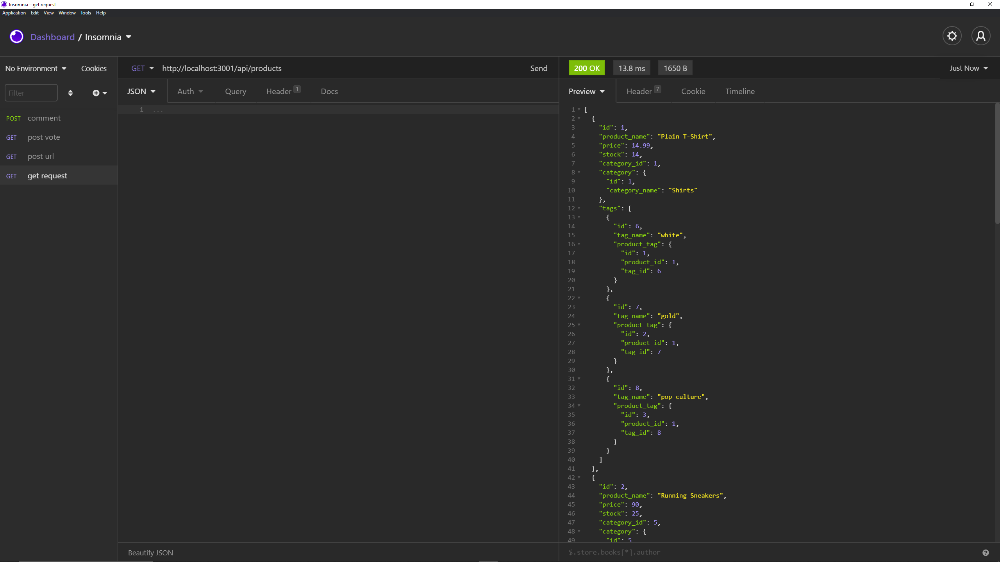

# **E-Commerce-back-end**   
## **In this weekly challenge, we were tasked with building a back end for an e-commerce site.  We utilized Node.js, Express.js, Sequelize and Dotenv NPM for creating this application.**

## **Table of Contents**

* [Deployed Application](#deployed-application)

* [Screenshot](#screenshot)

* [Features](#features)

* [Usage](#usage)

* [License](#license)

* [Badges](#badges)

* [Technology](#technology)

* [Contact](#contact-information)

## **Deployed Application**
Github 
https://mwpx777.github.io/E-Commerce-back-end/

Heroku
https://dashboard.heroku.com/apps/ecommerece-back-end-mwp

YouTube walkthrough video
https://www.youtube.com/watch?v=ivTL5UmBDSE

## **Screenshot**

## **Features**
This project features Node.js, Express.js, Sequelize and dotenv NPM

## **Usage**
This back end can be utilized for an e-commerce website

## **License**
(https://opensource.org/licenses/MIT)

## **Badges**

## **Technology**
Javascript,Node.js

## **Contact Information**
##### For questions or comments, please contact

* Github: (https://github.com/mwpx777)

* LinkedIn: (https://www.linkedin.com/in/mwpdesigns/)

* Email: (mwpx777@gmail.com)

